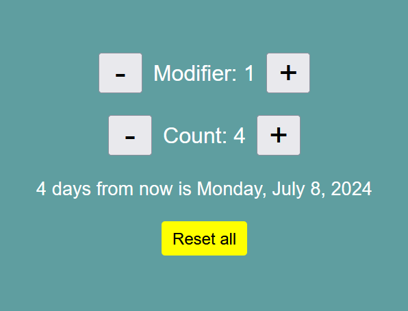

# React - useState exercise

# 🔗 [Live Preview]()

---

## About 👋

This exercise allows you to easily calculate and display a date based on a modifier and a count value. The project utilizes React's useState hook to manage the modifier and count state variables.
The calculateDate function dynamically calculates the date based on the count and modifier, taking into account past and future dates.
It also provides buttons to adjust the modifier, increment/decrement the count, and reset both values to their initial states.

---

## Languages

- React: conditionals, useState, functions, components
- Styling: basic
