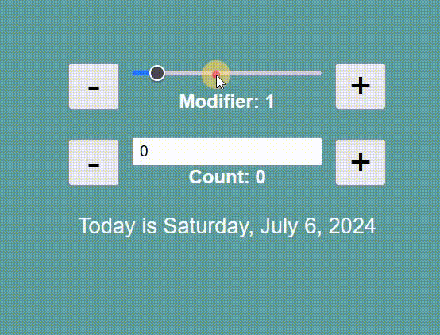

# React - useState exercise

# 🔗 [Live Preview](https://eloquent-cheesecake-4b7f0f.netlify.app/)

---

## About 👋

useState and React Controlled input elements practice

This exercise allows you to easily calculate and display a date based on a modifier and a count value. The project utilizes React's useState hook to manage the modifier and count state variables.
The calculateDate function dynamically calculates the date based on the count and modifier, taking into account past and future dates.
It also provides buttons to adjust the modifier, increment/decrement the count, and reset both values to their initial states.

UPDATE: two new input fields are added, through which the "modifier" and the "count" states can also be changed. The reset button is now conditionally rendered only if the two states are NOT at their default values

---

## Languages

- React: conditionals, useState, functions, components
- Styling: basic
